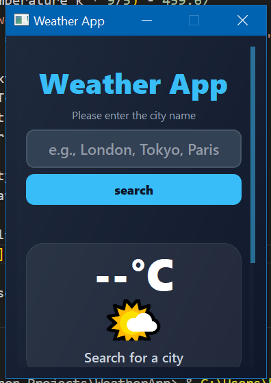
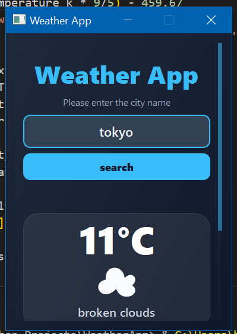
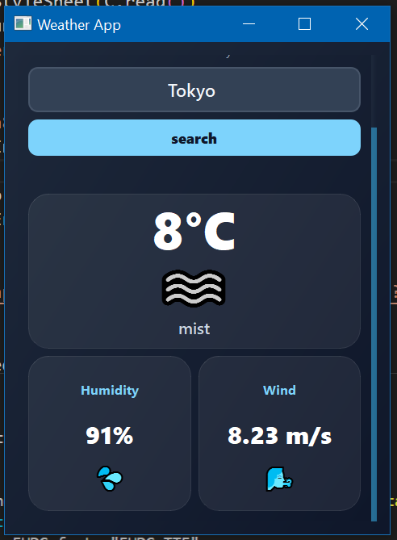

# Weather App

A modern desktop weather application built with PyQt5 that provides real-time weather information for any city worldwide.

## Features
- Real-time weather data from OpenWeatherMap API
- Temperature display in Celsius
- Weather condition icons (sun, clouds, rain, etc.)
- Humidity and wind speed information
- Clean, modern UI with gradient background
- Error handling for invalid cities and network issues

## Screenshots
![Weather App Screenshot]

## Screenshots





## Installation

### Prerequisites
- Python 3.7 or higher
- pip (Python package manager)

### Steps

1. Clone the repository:
```bash
git clone https://github.com/ali-faraz-py/python-weather-app.git
cd weather-app
```

2. Install dependencies:
```bash
pip install -r requirements.txt
```

3. Run the application:
```bash
python weatherapp.py
```

## How to Use
1. Enter a city name in the input field
2. Click "Search" or press Enter
3. View current weather, temperature, humidity, and wind speed
4. Search for another city anytime

## Technologies Used
- **Python 3.x** - Programming language
- **PyQt5** - GUI framework
- **OpenWeatherMap API** - Weather data
- **CSS** - Styling

## API Key
This project uses the OpenWeatherMap API. The demo key is included for testing, but for production use, get your own free API key at [openweathermap.org](https://openweathermap.org/api)

## Project Structure
```
weather-app/
├── weatherapp.py          # Main application code
├── weatherapp.css         # Styling
├── requirements.txt       # Python dependencies
└── README.md             # This file
```

## Future Improvements
- [ ] 5-day weather forecast
- [ ] Temperature unit toggle (°C/°F)
- [ ] Save favorite cities
- [ ] Weather alerts and notifications
- [ ] Dark/light theme toggle

## Known Issues
- API has a rate limit of 60 calls per minute (free tier)

## Contributing
Pull requests are welcome! For major changes, please open an issue first.

## License
This project is open source and available under the MIT License.

## Author
**Syed Ali Faraz**
- GitHub: [@ali-faraz-py](https://github.com/ali-faraz-py)
- Email: syedalifaraz52@gmail.com

## Acknowledgments
- Weather data provided by [OpenWeatherMap](https://openweathermap.org/)
- Icons: Emoji weather symbols
