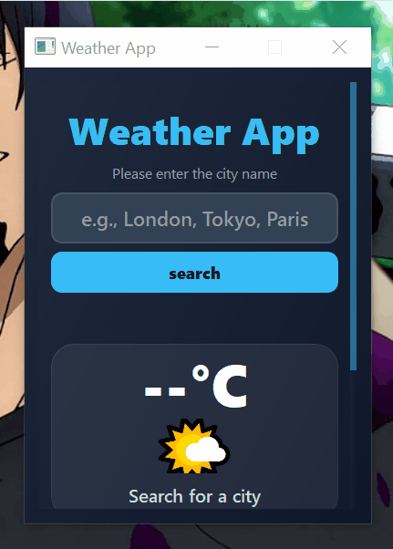

# 🌦️ Modern Weather App



A sleek, modern desktop weather application built with **Python** and **PyQt5**. This app provides real-time weather data, including temperature, humidity, and wind speed, using a beautiful dark-mode interface with smooth gradients and glassmorphism effects.

## ✨ Features
* **Real-time Data:** Fetches live weather information from the OpenWeatherMap API.
* **Detailed Metrics:** Displays temperature (Celsius), humidity (%), and wind speed (m/s).
* **Dynamic Icons:** Changes weather emojis (☀️, ❄️, 🌧️, ⛈️, etc.) based on the specific weather condition ID.
* **Modern UI:** Features a custom CSS-styled interface with a gradient background and hover effects.
* **Robust Error Handling:** Specific feedback for "City Not Found," connection issues, and invalid API requests.
* **Scrollable Content:** Responsive layout using `QScrollArea` for a clean look on all screen sizes.

## 🚀 Installation

1. **Clone the repository:**
   ```bash
   git clone [https://github.com/ali-faraz-py/python-weather-app.git](https://github.com/ali-faraz-py/python-weather-app.git)
   cd python-weather-app


Install dependencies:

```bash
pip install -r requirements.txt
```

Run the application:

```bash
python weatherapp.py
```


## 📂 Project Structure
```text
python-weather-app/
├── weatherapp.py       # Main Python logic & PyQt5 Layout
├── weatherapp.css      # Custom styling & glassmorphism theme
├── requirements.txt    # Project dependencies
├── README.md           # Project documentation
└── assets/             # App screenshots and demo GIF
```

### 🛠️ Built With

PyQt5 - The GUI framework for the desktop experience.

Requests - For handling API communication.

OpenWeatherMap API - Source for global real-time weather data.

Custom QSS - For the modern "Slate & Sky" theme.

### 👤 Author

**Syed Ali Faraz** - https://github.com/ali-faraz-py

If this project helped you learn PyQt5, please give it a ⭐!